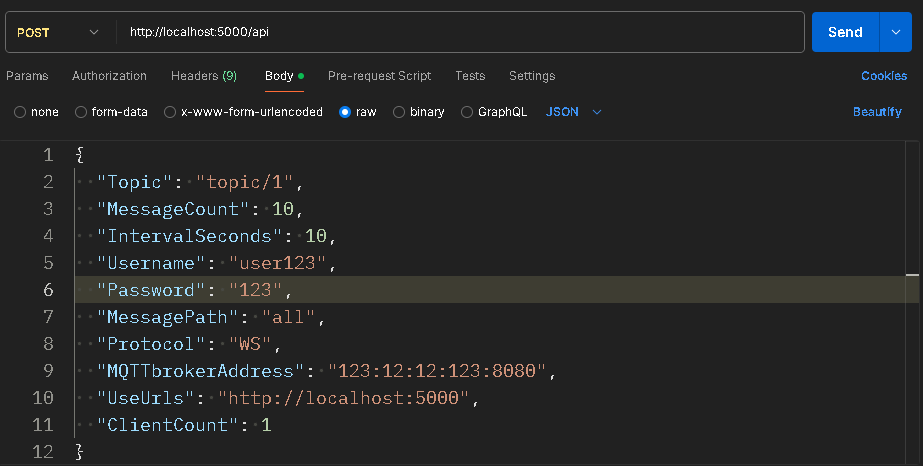

## Overview
The MQTT Publisher Application is a .NET console application that connects to an MQTT broker and publishes messages loaded from a JSON file. It includes functionality to handle multiple client connections and send messages in multiple rounds based on configuration settings. Additionally, an API controller is integrated, enabling users to publish messages dynamically using HTTP requests.

## Configuration
The application is configurable through a JSON file named `config.json`. Below is a description of each configuration parameter:

- `Topic`: MQTT topic under which the messages will be published.
- `MessageCount`: Number of message sending rounds.
- `IntervalSeconds`: Interval in seconds between each round.
- `Username`: Username for MQTT broker authentication.
- `Password`: Password for MQTT broker authentication.
- `MessagePath`: JSON path to select specific data from the JSON file or "all" to send the entire file.
- `Protocol`: Connection protocol ("TCP" or "WS" for WebSocket).
- `MQTTbrokerAddress`: Address of the MQTT broker.
- `UseUrls`: URLs to bind the integrated web server.
- `ClientCount`: Number of MQTT clients to connect to the broker.

Example configuration:
```json
{
  "Topic": "topic/1",
  "MessageCount": 10,
  "IntervalSeconds": 10,
  "Username": "user123",
  "Password": "123",
  "MessagePath": "all",
  "Protocol": "WS",
  "MQTTbrokerAddress": "123:12:12:123:8080",
  "UseUrls": "http://localhost:5000",
  "ClientCount": 1
}
```
## API Controller
The ApiController enables dynamic message publishing via HTTP requests. It is configured to receive POST requests that can be made using tools like Postman.

### Endpoints

- POST `/publish`: Accepts a JSON payload to publish a custom message to the configured MQTT topic.

Example using curl:



## Usage
To run the application, follow these steps:

1. Ensure you have .NET SDK installed on your machine.
2. Place the `config.json` and `data.json` (which should contain the JSON data to be sent as messages) in the root directory of the application.
3. From the command line, navigate to the directory containing the application and run:
```bash
dotnet run
```
4. The application will start and begin connecting to the MQTT broker, sending messages according to the configuration. The web server will also be available to handle API requests.

## Dependencies
This application uses several external libraries:

- MQTTnet: For handling MQTT client functionality.
- Newtonsoft.Json: For JSON parsing.
- Microsoft.AspNetCore: For hosting a web server alongside the MQTT client.

Make sure these dependencies are included in your project file (.csproj) and are restored using the dotnet restore command before running the application.
